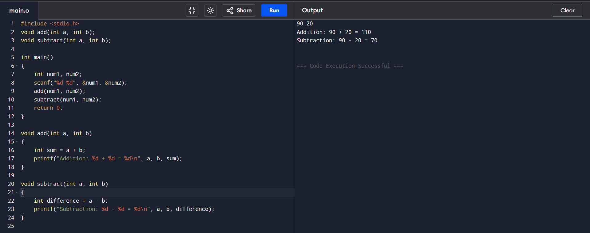

# EX-06 - Looping

## Name : A SATHYA NARAYANAN
## Register Number : 25016804
## AIM:
Write a C program to print even numbers ranging from M to N (including M and N values).

## ALGORITHM:
1.	Declare two integer variables to store the values of M and N.
2.	Use the printf function to prompt the user to enter the values of M and N.
3.	Use the scanf function to read the values of M and N from the user.
4.	Use a loop (for or while) to iterate from M to N.
5.	Inside the loop, check if the current number is even.
6.	If the current number is even, print it.
7.	Continue the loop until you have iterated through all numbers from M to N.

## PROGRAM:
```
#include <stdio.h>

int main() {
    int M, N, i;
    scanf("%d %d", &M, &N);
    printf("Even numbers from %d to %d are:\n", M, N);
    for (i = M; i <= N; i++) 
    {
        if (i % 2 == 0) 
        {
            printf("%d ", i);
        }
    }
    printf("\n");
    return 0;
}
```

## OUTPUT:


## RESULT:
Thus the program to print even numbers ranging from M to N (including M and N values) has been executed successfully
 
 


# EX-07-Nested-loop
## Name : A SATHYA NARAYANAN
## Register Number : 25016804

## AIM:

Write a C program to print the given triangular pattern using loop.

## ALGORITHM:

1.	Declare a variable to store the number of rows in the triangle.
2.	Use the printf function to prompt the user to enter the number of rows.
3.	Use a loop (for or while) to iterate through each row.
4.	Inside the loop, use another loop to print the desired number of asterisks for each row.
5.	Continue the loop until you have printed the entire triangular pattern.

## PROGRAM:
```
#include <stdio.h>

int main() {
    int rows, i, j;
    scanf("%d", &rows);
    for (i = 1; i <= rows; i++) 
    {
        for (j = 1; j <= i; j++) 
        {
            printf("* ");
        }
        printf("\n");
    }
    return 0;
}
```


## OUTPUT:


## RESULT:

Thus the program to print the given triangular pattern using loop has been executed successfully
 

# EX-08-Functions
## Name : A SATHYA NARAYANAN
## Register Number : 25016804

## AIM:

Write a C program to perform addition and subtraction of two numbers using functions (with argument and without return type).

## ALGORITHM:

1.	Declare two functions, one for addition and one for subtraction. Both functions should take two integer arguments.
2.	Inside the addition & subtraction function, add & subtract the two numbers and print the result.
3.	In the main function, declare two integer variables and read their values from the user.
4.	Call the addition and subtraction functions, passing the two numbers as arguments.

## PROGRAM:
```
#include <stdio.h>
void add(int a, int b);
void subtract(int a, int b);

int main() 
{
    int num1, num2;
    scanf("%d %d", &num1, &num2);
    add(num1, num2);
    subtract(num1, num2);
    return 0;
}

void add(int a, int b) 
{
    int sum = a + b;
    printf("Addition: %d + %d = %d\n", a, b, sum);
}

void subtract(int a, int b) 
{
    int difference = a - b;
    printf("Subtraction: %d - %d = %d\n", a, b, difference);
}
```


## OUTPUT:



## RESULT:

Thus the program to perform addition and subtraction of two numbers using functions has been executed successfully
 

# EX-09-Use For Loop
## Name : A SATHYA NARAYANAN
## Register Number : 25016804

## AIM:

Write a c program to find the sum of odd digits using for loop

## ALGORITHM:

1.	Declare variables to store the input number and the sum of odd digits.
2.	Initialize the sum of odd digits to 0.
3.	Use a for loop to iterate through each digit of the input number.
4.	Inside the loop, extract the rightmost digit of the number (using the modulo operator % and division by 10).
5.	If the digit is odd, add it to the sum of odd digits.
6.	Print the sum of odd digits.

## PROGRAM:
```
#include <stdio.h>

int main() {
    int num, digit, sum = 0;
    scanf("%d", &num);
    for (num; num > 0; num = num / 10) {
        digit = num % 10; 
        if (digit % 2 != 0) {
            sum += digit;
        }
    }
    printf("Sum of odd digits: %d\n", sum);
    return 0;
}
```


## OUTPUT:


## RESULT:
Thus the program to find the sum of odd digits using for loop has been executed successfully.


# EX – 10 - Factorial of a Number Using a Function
## Name : A SATHYA NARAYANAN
## Register Number : 25016804
## AIM:
To write a C program that calculates the factorial of a given number using a user-defined function.
## ALGORITHM:
1.	Start
2.	Declare the function fact().
3.	In the main() function, call the fact() function.
4.	In fact() function:
a.	Declare variables i, N, and fact (initialized to 1).
b.	Read an integer N from the user.
c.	Use a for loop from 1 to N:
i.	Multiply fact by i in each iteration.
d.	After the loop, print the factorial value.
5.	End

## PROGRAM:
```
#include <stdio.h>
long int fac(int a)
{
    long int fac=1;
    for (int i=1;i<=a;i++)
    {
        fac*=i;
    }
    return fac;
}
int main()
{
    int n;
    scanf("%d",&n);
    printf("Factorial value is: %ld",fac(n));
}
```


## OUTPUT:


## RESULT:
The program correctly computes the factorial of a given number using a separate function and displays the result.
 